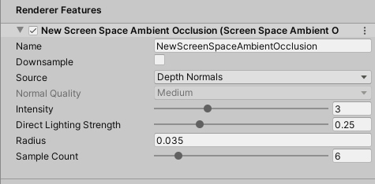
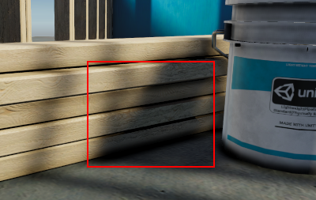
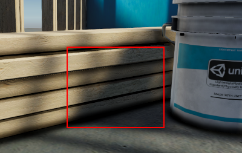

# Ambient Occlusion

The Ambient Occlusion effect darkens creases, holes, intersections and surfaces that are close to each other. In the real world, such areas tend to block out or occlude ambient light, so they appear darker.

URP implements the Screen Space Ambient Occlusion (SSAO) effect as a [Renderer Feature](urp-renderer-feature.md). It works with every shader that the Universal Render Pipeline (URP) provides as well as any custom opaque Shader Graphs you create.

> **Note**: The SSAO effect is a Renderer Feature and works independently from the post-processing effects in URP. This effect does not depend on or interact with Volumes.

The following images show a scene with the Ambient Occlusion effect turned off, on, and only the Ambient Occlusion texture.

 _Scene with Ambient Occlusion effect turned off._

 _Scene with Ambient Occlusion effect turned on._

 _Scene with only the Ambient Occlusion texture._

## Adding the SSAO Renderer Feature to a Renderer

URP implements the Ambient Occlusion effect as a Renderer Feature.

To use the SSAO effect in your project follow the instructions on [How to add a Renderer Feature to a Renderer](urp-renderer-feature-how-to-add.md) and add the Screen Space Ambient Occlusion Renderer Feature.

## Properties

This section describes the properties of the SSAO Renderer Feature.

 _SSAO Renderer Feature properties._

### Name

The name of the Renderer Feature.

### Downsample

Selecting this check box reduces the resolution of the Pass that calculates the Ambient Occlusion effect by a factor of two.

**Performance impact**: very high.

Reducing the resolution of the Ambient Occlusion Pass by a factor of two reduces the pixel count to process by a factor of four. This reduces the load on the GPU significantly, but makes the effect less detailed.

### Source

Select the source of the normal vector values. The SSAO Renderer Feature uses normal vectors for calculating how exposed each point on a surface is to ambient lighting.

Available options:

* **Depth Normals**: SSAO uses the normal texture generated by the `DepthNormals` Pass. This option lets Unity make use of a more accurate normal texture.
* **Depth**: SSAO does not use the `DepthNormals` Pass to generate the normal texture. SSAO reconstructs the normal vectors using the depth texture instead. Use this option only if you want to avoid using the `DepthNormals` Pass block in your custom shaders. Selecting this option enables the **Normal Quality** property.

**Performance impact**: depends on the application.

When switching between the options **Depth Normals** and **Depth**, there might be a variation in performance, which depends on the target platform and the application. In a wide range of applications the difference in performance is small. In most cases, **Depth Normals** produces better visual look.

For more information on the Source property, refer to [Implementation details](#implementation-details).

### Normal Quality

This property becomes active when you select the option Depth in the **Source** property.

Higher quality of the normal vectors produces smoother SSAO effect.

Available options:

* **Low**
* **Medium**
* **High**

**Performance impact**: medium.

In some scenarios, the **Depth** option produces results comparable with the **Depth Normals** option. But in certain cases, the **Depth Normals** option provides a significant increase in quality. The following images show an example of such case.

 _Source: Depth. Normal Quality: Low._

 _Source: Depth. Normal Quality: Medium._

 _Source: Depth. Normal Quality: High._

 _Source: Depth Normals._

For more information, refer to [Implementation details](#implementation-details).

### Intensity

This property defines the intensity of the darkening effect.

**Performance impact**: insignificant.

### Direct Lighting Strength

This property defines how visible the effect is in areas exposed to direct lighting.

**Performance impact**: insignificant.

The following images show how the **Direct Lighting Strength** value affects different areas depending on whether they are in the shadow or not.

 _Direct Lighting Strength: 0.2._

 _Direct Lighting Strength: 0.9._

### Radius

When calculating the the Ambient Occlusion value, the SSAO effect takes samples of the normal texture within this radius from the current pixel.

**Performance impact**: high.

Lowering the **Radius** setting improves performance, because the SSAO Renderer Feature samples pixels closer to the source pixel. This makes caching more efficient.

Calculating the Ambient Occlusion Pass on objects closer to the Camera takes longer than on objects further from the Camera. This is because the **Radius** property is scaled with the object.

### Sample Count

For each pixel, the SSAO Render Feature takes this number of samples within the specified radius to calculate the Ambient Occlusion value. Increasing this value makes the effect smoother and more detailed, but reduces the performance.

**Performance impact**: high.

Increasing the **Sample Count** value from 4 to 8 doubles the computational load on the GPU.

## Implementation details

The SSAO Renderer Feature uses normal vectors for calculating how exposed each point on a surface is to ambient lighting.

URP 10.0 implements the `DepthNormals` Pass block that generates the the normal texture `_CameraNormalsTexture` for the current frame. By default, the SSAO Renderer Feature uses this texture to calculate Ambient Occlusion values.

If you implement your custom SRP and if you do not want to implement the `DepthNormals` Pass block in your shaders, you can use the SSAO Renderer Feature and set its **Source** property to **Depth**. In this case, Unity does not use the `DepthNormals` Pass to generate the normal vectors, it reconstructs the normal vectors using the depth texture instead.

Selecting the option **Depth** in the **Source** property enables the **Normal Quality** property. The options in this property (Low, Medium, and High) determine the number of samples of the depth texture that Unity takes when reconstructing the normal vector from the depth texture. The number of samples per quality level: Low: 1, Medium: 5, High: 9.
