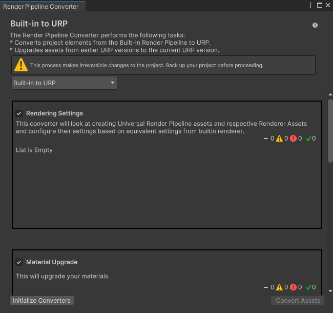
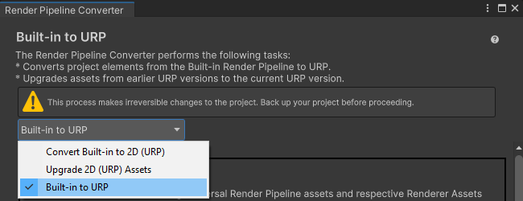
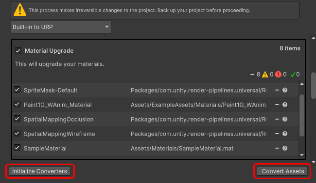
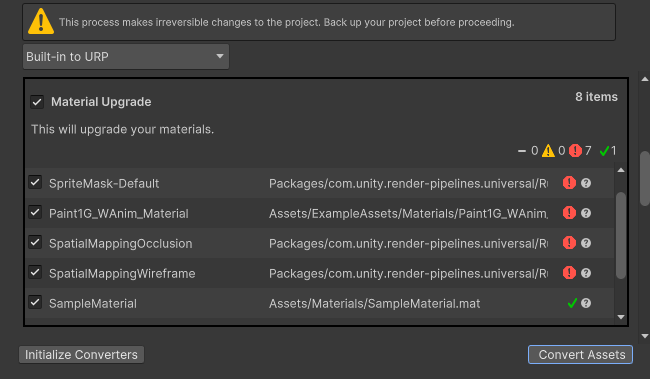

# Render Pipeline Converter

The **Render Pipeline Converter** converts assets made for a Built-in Render Pipeline project to assets compatible with URP.

> **NOTE:** The conversion process makes irreversible changes to the project. Back up your project before the conversion.

## How to use the Render Pipeline Converter

To convert project assets:

1. Select **Window** > **Rendering** > **Render Pipeline Converter**. Unity opens the Render Pipeline Converter window.

    

2. Select the conversion type.

    

3. Depending on the conversion type, the dialog shows the available converters. Select or clear the check boxes next to converter names to enable or disable the converters.

    

    For the list of available converters, refer to [Converters](#converters).

4. Click **Initialize Converters**. The Render Pipeline Converter preprocesses the assets in the project and shows the list of elements to convert. Select or clear check boxes next to assets to include or exclude them from the conversion process.

    

    **Yellow icon**: a yellow icon next to an element indicates that a user action might be required to run the conversion. Hover the mouse pointer over the icon to see the description of the issue.

5. Click **Convert Assets** to start the conversion process.

    > **NOTE:** The conversion process makes irreversible changes to the project. Back up your project before the conversion.

    When the converter finishes processing all the selected elements, it shows the status of each element in the window.

    

    **Green check mark**: the conversion went without issues.

    **Red icon**: the conversion failed.

6. With the converter window open, inspect the elements with the warnings. After reviewing the converted project, close the Render Pipeline Converter window.

## Conversion types and converters

The Render Pipeline Converter let's you select one of the following conversion types:

* Built-in Render Pipeline 2D to URP 2D

* Upgrade 2D URP Assets

* Built-in Render Pipeline to URP

When you select on of the conversion types, the tool shows you the available converters.

The following sections describe the converters available for each conversion type.

### Built-in Render Pipeline 2D to URP 2D

This conversion type converts elements of a project from Built-in Render Pipeline 2D to URP 2D.

Available converters:

* **Material and Material Reference Upgrade**

    This converter converts all Materials and Material references from Built-in Render Pipeline 2D to URP 2D.

### Upgrade 2D URP Assets

This conversion type upgrades assets of a 2D project from an earlier URP version to the current URP version.

Available converters:

* **Parametric to Freeform Light Upgrade**

    This converter converts all parametric lights to freeform lights.

### Built-in Render Pipeline to URP

This conversion type converts project elements from the Built-in Render Pipeline to URP.

Available converters:

* **Rendering Settings**

    This converter creates the URP Asset and Renderer assets. Then the converter evaluates the settings in the Built-in Render Pipeline project and converts them into equivalent properties in the URP assets.

* **Material Upgrade**

    This converter converts the Materials.

* **Animation Clip Converter**

    This converter converts the animation clips. It runs after the **Material Upgrade** converter finishes.

* **Read-only Material Converter**

    This converter converts the pre-built read-only Materials that come with a Unity project. This converter indexes the project and creates the temporary `.index` file. This might take a significant time.
